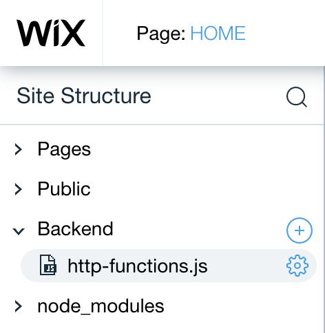
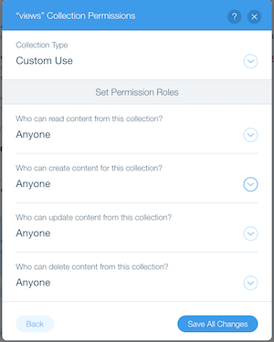
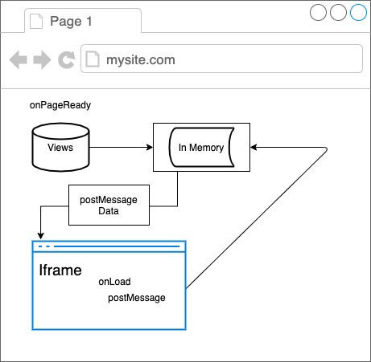
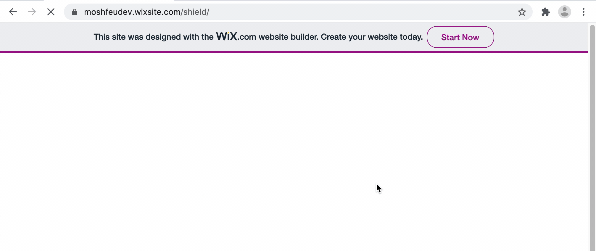

Disclaimer: I’m a Frontend developer at Wix, that’s right. But this post written as a result of my experience as a “regular” user. I even used a non Wix account to build it and honestly, even if 1000 of you will build an app on Wix, I won’t profit from it directly in any way 😀

So why I wrote this post? I really enjoyed building it. It’s simple (well, most of the parts), zero configuration, and of course, it’s free. Ah, and you don’t need to leave the browser — 100% cloud.

It all started when I published a package on npm and wanted to track the page views. Long time ago, I used “[hits](https://hits.dwyl.com/dwyl/start-here)” for the same purpose but now I thought that it can be interesting to build something like that by myself. Also, hits just gives the number of page views. I though it can be nicer to have more segmented data, by time, refers, geo location etc.

## What’s needed for an Analytics app?

Every analytics tool has at least the basic components:

* Embedded resource in the host site — script, image (pixel) etc. which send a request with relevant information about the user, the browser, ip, geo etc.

* Server to handle the requests.

* Database to store the records.

* Client app to display the data usually in a graphic way — tables, graphs, maps etc.

Another nice to have components:

* Monitoring

* Environments — staging / production for both the server and the database

* Authentication — only allowed user can have access to the data

All those component is part of Corvid and Wix echo-system out of the box with zero configurations.

## Let’s Start

I won’t explain how to create a website on Wix (I recommend to start with the “[blank template](https://editor.wix.com/html/editor/web/renderer/new?siteId=cbf36d3a-49d0-41c2-9482-1bb58d5fdda3&metaSiteId=a573279f-ae6f-46d1-8556-7c93ae9b2c84)”), it’s straightforward, well documented and take few minutes. It takes another second to [enable Corvid](https://support.wix.com/en/article/getting-started-with-corvid-by-wix) on the website.
Also, I won’t explain how to do things which already well documented. Instead, I added links so you can get all the information you need from them. (If I missed some, please let me know).

Now let’s implement the components we talked about few lines ago.

**Embedded Resource**

There are several ways to do it. I choose to expose an endpoint which returns an SVG and just before that, add a record in the database. This way, I show a nice SVG badge in the package page and at the same time, it sends a request back to the server. I know I didn’t invent the wheel, “hits” does exactly the same, but I’m just about to show you how much it’s easy in Corvid.

Corvid hosts the code of both of the sides — the client and the server, just like a nodejs based website which uses JavaScript both on the client and the server side.

In order to expose an endpoint for external sources, we need to write a special server code (located under the “Backend” folder)? Why it’s special? Because usually the server code is accessible only internally to the website’s pages.
In order to create this special module, the file name should be called
“[http-functions.js](https://www.wix.com/corvid/reference/wix-http-functions)”.

*http-functions.js to expose an endpoint for external calls*

Following the [methods naming convention](https://www.wix.com/corvid/reference/wix-http-functions/introduction), I created the “view” endpoint which accepts `GET` requests and respond with SVG [1].

```js
import {ok} from 'wix-http-functions';

export async function get_view(request) {
  const svg = `<svg>....</svg>`;
  const response = {
    headers: {
      'Content-Type': 'image/svg+xml',
      'Content-Length': svg.length,
    },
    body: svg,
  };
  return ok(response);
}
```


[Demo](http://moshfeudev.wixsite.com/shield/_functions/view_demo)

**Saving the Data**

Corvid offers a [built-in database](https://support.wix.com/en/article/corvid-working-with-wix-data) (“Content Manager”) with a strong yet easy API, called `wixData`.

First thing is creating a table (“collection”) — `views` and add the following columns: `headers` (as Text), `refrer` (as Text). This will be enough for the basic app, you can add more of course (I added `project` so I could embed as many resources as I want).

It’s a good time to mention that, when you create a collection, pay attention to the permission section (“What’s the collection for?”). Start with set “anyone” to all the methods and customize it as you go.

*Permissions settings*

Now we can modify the endpoint code to extract the relevant information from the request and save it in `views`.

```js
try {
  await wixData.insert('views', {
    referer,
    headers: JSON.stringify(headers),
  })
} catch (error) {
  console.log(error);
}
```


(You can see the logs in the “[Site Monitoring](https://support.wix.com/en/article/corvid-about-site-monitoring)”)

The nice thing about the `headers` is that they contain geo location information out of the box, so later, we can show a geo location visualization.

Now, when we have all the data, we want to show it visually.

**Client App**

This step should be straightforward, right? After all, Wix is a UI builder before anything. The good news is that for some components, it’s true. For example, it’s very easy to create a table and connect it to the database. It can be done even without coding. But when it comes to more sophisticated visualization elements such as graphs, charts, maps etc. there are no built-in options nor external apps to connect the data to the elements.
So there is no easy way (As fat as I know) but there is a way shown in this [tutorial](https://www.wix.com/corvid/example/create-a-custom-chart) and that’s how I did it, but I have to admit that it’s not that convenient. I hope it will be changed in the future.

In a nutshell, the challenge is that even though we can “interact” with components through Corvid code, we are not interacting with the DOM itself but with a special isolated DOM **like**. As a result, we can’t use JavaScript libraries which depends on interacting with the actual DOM.
The only (free) way to have access to a DOM is by adding an “HTML iframe” component. But here is the catch, we can’t inject data into the iframe directly because the communication between the page and the iframe has to be through post messages.

So here is the flow starts on page ready.

1. Get the data from the `views` table.
1.1 In parallel, render the iframe (handle by Wix).
1.2. Establish an event listener to get messages from the iframe.

1. The iframe initiating a chart library, establish an event listener to get messages from the page, and posts a message to the parent saying “I’m ready”.

1. The page (waits for the data if needed and) posts a message back with the data.

1. The iframe gets the data and draw the chart accordingly.

If I missed you, maybe a diagram will help:

*The diagram shows the flow and the communication between the page and the iframe*

In this project, I’m using Google’s “[Line Chart](https://developers.google.com/chart/interactive/docs/gallery/linechart)” so we need to fit the data to the `[DataTable`](https://developers.google.com/chart/interactive/docs/datatables_dataviews#emptytable) format.

**The iframe’s code**

![Luckily, we don’t need to host the iframe’s code anywhere, we can set its code directly in the Editor [2].](1Vr05wRrYTy64LyAdl1x-sg.png)*Luckily, we don’t need to host the iframe’s code anywhere, we can set its code directly in the Editor [2].*

Here is the code (notice the “loader” 😉)

```html
<!DOCTYPE html>
<html>
  <body>
    <script
      type="text/javascript"
      src="https://www.gstatic.com/charts/loader.js"
    ></script>
    <div id="chart_div"></div>
    <siv id="loading">Loading...</siv>

    <script>
      // Initiate google charts
      google.charts.load('current', { packages: ['corechart', 'line'] });
      google.charts.setOnLoadCallback(init);

      function onEvent(details) {
        const data = new google.visualization.DataTable();
        data.addColumn('date', 'day');
        data.addColumn('number', 'Page Views');

        data.addRows([...details]);

        const options = {
          pointSize: 5,
          hAxis: {
            title: 'Time',
            format: 'dd/MM/yy',
          },
          vAxis: {
            title: 'Popularity',
          },
        };

        const chart = new google.visualization.LineChart(
          document.getElementById('chart_div')
        );

        chart.draw(data, options);
      }

      function init() {
        // Listen to messages from the page
        window.addEventListener('message', ({ data: { type, data } }) => {
          if (type === 'graph') {
            onEvent(data);
            document.querySelector('#loading').style.display = 'none';
          }
        });
      }
      // Tell the page the iframe's ready
      window.parent.postMessage({ type: 'ready' }, '*');
    </script>
  </body>
</html>
```

**The page code**

```javascript
import wixData from 'wix-data';
import _ from 'lodash';

$w.onReady(function () {
  const getDataPromise = wixData.query('views').find();

  // The iframe is ready
  $w('#html1').onMessage(async ({ data }) => {
    if (data.type === 'ready') {
      const results = await getDataPromise;

      // Group the rows by date and map it to DataTable format
      const chartData = Object.entries(
        _.groupBy(results.items, (item) => item._createdDate.toDateString())
      ).map(([date, entities]) => [new Date(date), entities.length]);

      // Post back to the page with the data
      $w('#html1').postMessage({
        type: 'graph',
        data: chartData,
      });
    }
  });
});
```

And the result

*How it looks on Chrome*

If you don’t want this page to be visible to everyone, [you can limit it](https://support.wix.com/en/article/limiting-pages-on-your-site-to-specific-members-member-roles).

This is it basically. From this point you can take it to wherever your imagination can take you — hit maps, different categorization, comparing timestamp etc. If you need my help with that, leave a comment or reach out.

If you want to get a copy of this website, let me know and I’ll send a copy to your Wix account.

And usually, if you have questions or ideas about how to improve this post (or my other posts), leave a comment or say hi 👋
[**Moshe Feuchtwanger - Frontend Developer - Wix.com | LinkedIn**
*View Moshe Feuchtwanger's profile on LinkedIn, the world's largest professional community. Moshe has 7 jobs listed on…*www.linkedin.com](https://www.linkedin.com/in/moshfeu/)

[1] The endpoint can also respond with another image types such as png, jpg etc. encoded by base64

```js
const img = Buffer.from('iVBORw0KGgoAAAANSUhEUgAAAAEAAAABCAYAAAAfFcSJAAAADUlEQVQYV2PgjOr/DwADVAHy2H3MYgAAAABJRU5ErkJggg==', 'base64')
const response = {
  headers: {
    'Content-Type': 'image/png',
    'Content-Length': img.length
  },
  body: img
};

return ok(response);
```


[2] Yah, it’s a bit annoying to edit the code in the Editor, copy / paste it in your favorite code editor and then copy / paste it back.