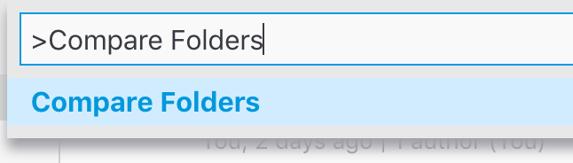

In the [last post](https://medium.com/@moshfeu/comparefolders-visual-studio-code-extension-journey-intro-b540a0539629), we talked about the plugin, the requirements and the motivations.
Like promised, the post will includes an explanation about the product challenge and how to solve it.

## The Challenge

In order to let the users to compare folders, we need to allow them to run a command that will open the “choose a folder” dialog so they could choose a folder from their file system. Once they chosen, the plugin will run the code that compare them. So:

## How to add a command to commands palette in vscode extension?

Basically it well explained in the [docs](https://code.visualstudio.com/api/get-started/extension-anatomy) so let’s do it quick

First, we need to add a entity in *package.json* root

```json
"contributes": {
  "commands": [
    {
      "command": "extension.compare",
      "title": "Compare Folders"
    }
  ]
},
```


Second, the command need to be registered during the plugin activation (*extension.ts*).

```ts
export function activate(context: vscode.ExtensionContext) {
  let disposable = vscode.commands.registerCommand('extension.compare', () => {
    compare(); // we'll get this later
  });

  context.subscriptions.push(disposable);
}
```


Notice that the `command` in the *package.json* and the one which sent to `registerCommand` have to be the same.

Now, when users will open the [command palette](https://code.visualstudio.com/docs/getstarted/userinterface#_command-palette) they will get this (if not, they will need to start typing

*Compare Folders command in the command palette*

Now that plugin have an “entry point” followed by a user interaction, we need another piece in the puzzle, let the users to choose a folder.

## How to let users to choose a folder in vscode extension?

The API for opening the file system is `window.showOpenDialog` ([docs](https://code.visualstudio.com/api/references/vscode-api#2294)). It takes an “options” object as single argument and returns `Thenable` (Something like `Promise`). By default it allows to choose only files. That can be changes by passing `canSelectFolder: true` in the options object.

```ts
const options: vscode.OpenDialogOptions = {
  canSelectMany: false,
  canSelectFolders: true,
};

vscode.window.showOpenDialog(options).then(fileUri => {
  if (fileUri && fileUri[0]) {
    console.log(fileUri[0].fsPath);
  }
});
```


The last part for this post is how to, eventually, compare the folders and display the diff in a diff view?

## How to compare folders by content?

The extension uses the [dir-compare](https://www.npmjs.com/package/dir-compare) package for this. Here is the code that does it (with comments)

```ts
// open folder picker dialog to choose first folder
const folder1 = await openFolder();

// open folder picker dialog to choose second folder
const folder2 = await openFolder();

// compare folders by contents
const options = {compareContent: true};

// do the compare
const res = compareSync(
  folder1,
  folder2,
  options
);

// get the diffs
const { diffSet = [] } = res;

// diffSet contains all the files and filter only the not equals files and map them to pairs of Uris
const diffs = diffSet
  .filter(diff => diff.state === 'distinct')
  .map(diff => [`${diff.path1}/${diff.name1}`, `${diff.path2}/${diff.name2}`]);
```


And finally

## How to ask vscode to display a “compare” view?

Using the vscode command `vscode.diff` the extension opens a diff view with the contents of both of the files.

```ts
await vscode.commands.executeCommand('vscode.diff',
  vscode.Uri.file(diffs[0][0]),
  vscode.Uri.file(diffs[0][1]),
  'My great Diff'
);
```


Notice that currently, it takes only the first pair. This code meant to simplify the explanation and to show only how to use the package and the `diff` API. In the next post, I’ll show the real approach that present a list of all the changes and let the user to pick them one by one.

[Source code for this post](https://github.com/moshfeu/vscode-compare-folders/tree/d970aaad87dcb3b5c31997c23e807ef0f53ddcdc)

Have something to say? I’ll love to 👂