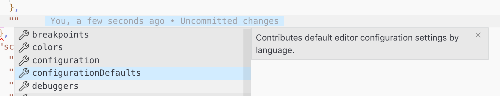
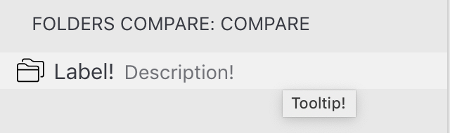

In the [last post](https://medium.com/@moshfeu/comparefolders-a-visual-studio-code-extension-journey-part-ii-dfe4d249219e?source=friends_link&sk=c04faf7cbcc55057d29cd6e3c6117c04), we talked about how to add a command to the commands palette so the user could interact with the plugin via commands. In our case, ask the compare process to start.
We also talked about, how to open folder picker so the users could pick which folder(s) they want to compare.
And finally, how to compare folders and present the diff using the API.

Like promised, the post will includes an explanation about the product challenge and how to solve it.

## The Challenge

Now that we able to compare folders by command, and we know how to display the “diff” view, we want to change the product a bit and divide the process to some steps.

First, we want to present a dedicated panel in the “side bar”. In this panel, there will be the option to open a folder (only one, the other is the current opened folder, maybe we’ll change it later). We also need to add an icon to the “activity bar” so click on it, will open the panel.

](1M5qhLi_R-6OXZbOQQrbIog.png)*What is the “activity bar” and “sidebar”? For more info: [https://code.visualstudio.com/docs/getstarted/userinterface](https://code.visualstudio.com/docs/getstarted/userinterface)*

Then, when the user chosen a folder and there are diffs, we want to present a list of the files. When the user clicks on a file, the extension will present the diff view. So:

## How to add an icon to the activity bar?

Vscode using the *package.json *file for the plugin configuration too. Don’t worry, you get an intellisense and short explanations!



The following configuration under will add an icon with certain title. The `id` will be useful later.

```json
{
  ...
  "contributes": {
    ...
    "viewsContainers": {
      "activitybar": [{
        "id": "foldersCompare",
        "title": "Folders Compare",
        "icon": "resources/icon.svg" // relative to root
      }]
    }
  }
}
```


This is not enough because we need to add a panel / view so when the users will click on that icon, they will get a dedicated panel, just like the “explorer”, the “search” and the “source control” panels etc.
If we’ll not add that panel, vscode will not present the icon and warn us that:
> [undefined_publisher.compare-folders]: View container ‘foldersCompare’ does not exist and all views registered to it will be added to ‘Explorer’.

## How to add a view and “attach” it to the activity icon?

This step is a bit complex so keep the track.

**Step 1
**Let’s back to the *package.json** ***and add configuration for this:

```json
{
  ...
  "contributes": {
    ...
    "viewsContainers": {
      "activitybar": [{
        "id": "foldersCompare",
        "title": "Folders Compare",
        "icon": "resources/icon.svg"
      }]
    },
    "views": {
      "foldersCompare": [{
        "id": "foldersCompareAppService",
        "name": "Compare"
      }]
    }
  }
}
```


**Step 2
**We will use a [“TreeView”](https://code.visualstudio.com/api/extension-guides/tree-view) to present diffs between the files so we need to register that view in the *extension.ts *file. (The provider constructor can get nothing. We’ll talk about why we pass `rootPath` later.

```ts
import { CompareFoldersProvider } from './providers/foldersCompareProvider';

export function activate(context: ExtensionContext) {
  const foldersCompareProvider = new CompareFoldersProvider(workspace.rootPath);
  window.registerTreeDataProvider('foldersCompareAppService', foldersCompareProvider);
}
```


**Step 3
**We need to create the `CompareFoldersProvider` which is a *class *that implement a `TreeDataProvider` *interface*.

For this stage, it will be enough to explore only the 2 required methods:

* `getChildren` — Returns an Array (can also return `Promise` of Array) of data. It doesn’t matter which type the data items will be because the next method will take care of converting the data into `TreeItem`. In our case, the method returns already `TreeItem` so the next method just returns the element it got. (It could also get element for nesting hierarchy but it’s not relevant for now)

* `getTreeItem` — Gets an item from the array of `getChildren` and returns a `[TreeItem`](https://code.visualstudio.com/api/references/vscode-api#TreeItem)

In that view we want to present 2 types of items: A “button” like so when the user will clicks on it, it will ask for choosing a folder to compare. And the diffs tree itself (a list of all the diffs between the 2 folders).

In short (the full code is in the extension’s repository, you can find the link in at the end of this post)

In the extension we used a *class *that extends `TreeItem` and has the following properties: `label`, `tooltip`, `description` and `icon`

*See how each property take affect*

The last important property (for now) is the `command`. Using that property we can tell vscode what to do when the user clicks on it.

Like any other extension’s command, it needed to be registered in the extension’s `activate` hook.

As you probably remember, we have 2 types of items in the view. So the command of the “button” will [open the folder picker](https://medium.com/@moshfeu/comparefolders-a-visual-studio-code-extension-journey-part-ii-dfe4d249219e#acc0) and click on the items will open the [diffs view](https://medium.com/@moshfeu/comparefolders-a-visual-studio-code-extension-journey-part-ii-dfe4d249219e#5342).

Now, the view should looks like that:
<iframe src="https://cdn.embedly.com/widgets/media.html?src=https%3A%2F%2Fwww.youtube.com%2Fembed%2Fc6_ltRKYMZ0%3Ffeature%3Doembed&url=http%3A%2F%2Fwww.youtube.com%2Fwatch%3Fv%3Dc6_ltRKYMZ0&image=https%3A%2F%2Fi.ytimg.com%2Fvi%2Fc6_ltRKYMZ0%2Fhqdefault.jpg&key=a19fcc184b9711e1b4764040d3dc5c07&type=text%2Fhtml&schema=youtube" width="100%" height="480" />

There are more logics that didn’t explained here because it required specifically for the extension. Please go to the source code to get a better picture.

[Source code for this post](https://github.com/moshfeu/vscode-compare-folders/tree/1dca9e9fe0a54b04b72e139ff3fa2bd821663f6c)

Have something to say? I’ll love to 👂