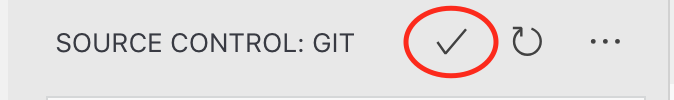
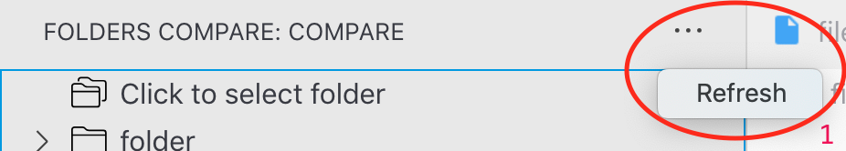

In the [last post](https://medium.com/@moshfeu/he-activity-comparefolders-a-visual-studio-code-extension-journey-part-ii-77e0467a12f6?source=friends_link&sk=34deefe0a5a41ce97c6197a5f2813e0f), we talked about how to add an icon to the activity bar and “attach” a view to it. How to use `TreeDataProvider` to present File System like view to show the diffs like files in directories.

Like promised, the post will includes an explanation about the product challenge and how to solve it.

## The Challenge

In the last post, the extension was able to show only single hierarchy of differences. Means if a deep folder has differences the extension wasn’t be able to show it. This challenge, obviously, is not a vscode extension specifically but I splatted the commits so this refactor will “get” its own commit to isolate the logic and maybe will help to someone else with such task.

Back to the series’ format — vscode extension challenges, the extension should allow the users to refresh the folders view after some change has been made in a file / folder. So we’ll add a button to the panel’s “top bar” and when the user will click on it, the compare logic will run again and will refresh the view. Once the view refreshed, the extension will show an information popup about that.

*A “top bar” button in the source control panel*

So

## How to display a button in a view’s top bar?

In order to display a button we need some steps: We need to add the button as a “contributer” in the `contributes` section and specify the command that we want to run when it clicked. Therefore, we need to add that command to the `commands` section, also in the *package.json.* And finally, we need to register that command in the extension’s activation call.

**Step 1**

Add the “refresh” command in the `commands` section in *package.json*

```json
"commands": [
  ...
  {
    "title": "Refresh",
    "command": "foldersCompare.refresh",
    "icon": "resources/refresh.svg"
  }
]
```


**Step 2**

Add the “refresh” button in the top bar in the `contributes-&gt;menus` section in *package.json*

```json
"contributes": {
  ...
  "menus": {
    "view/title": [{
      "command": "foldersCompare.refresh",
      "group": "navigation"
    }]
  },
}
```


`command` is the key of the command and `group` is the place we want to present the button inside the top bar. By default it will be presented under the “more” menu:



**Step 3**

Register the command in the extension’s activation call

```ts
export function activate(context: ExtensionContext) {
  ...
  commands.registerCommand(REFRESH, foldersCompareProvider.refresh);
}
```


**Step 4**

Finally, we need to implement the “refresh” functionality and ask vscode refresh the view.

```ts
refresh = (): void => {
  try {
    /*
     get (from memory) the current path of the compared folder
     and do the comparison again
    */
    this._diffs = compare(this.workspaceRoot, getComparedPath());
    // ask vscode to refresh to view
    this._onDidChangeTreeData.fire();
    // show a message to the user
    window.showInformationMessage('Source refreshed', 'Dismiss');
  } catch (error) {
    console.log(error);
  }
}
```


Notice that the `onDidChangeTreeData.fire` event shouldn’t call with arguments, otherwise, none of the functions (`getChildren` not `getTreeItem`) will be fired.

Notice also that the `refresh` method declared as an arrow function to bind it to the `foldersCompareProvider` instance. When vscode will invoke that function it will run in the context of the instance (Is that clear enough?)

Finally, we want to show an information message with a “dismiss” button to let them know that the sourced refreshed (in case the change in deep path and not visible in the UI right away)

And this is the result
<iframe src="https://cdn.embedly.com/widgets/media.html?src=https%3A%2F%2Fwww.youtube.com%2Fembed%2F6208d7IZMpo%3Ffeature%3Doembed&url=http%3A%2F%2Fwww.youtube.com%2Fwatch%3Fv%3D6208d7IZMpo&image=https%3A%2F%2Fi.ytimg.com%2Fvi%2F6208d7IZMpo%2Fhqdefault.jpg&key=a19fcc184b9711e1b4764040d3dc5c07&type=text%2Fhtml&schema=youtube" width="100%" height="480" />

[Source code for this post](https://github.com/moshfeu/vscode-compare-folders/tree/ccf0b516b6a9eb9c1590d69580baaede0102582f)

Have something to say? I’ll love to 👂