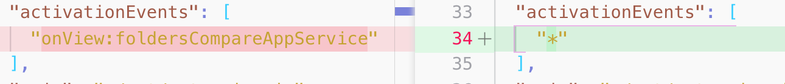
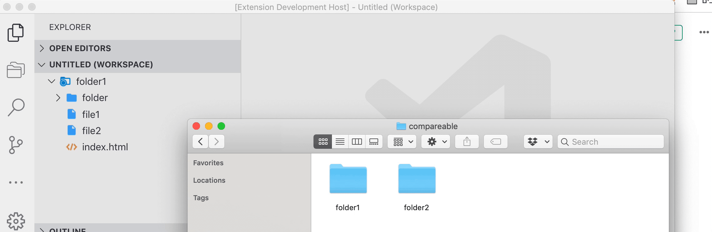

In the [last post](https://medium.com/@moshfeu/comparefolders-a-visual-studio-code-extension-journey-part-iv-a26264e841a3?source=friends_link&sk=e21b42e8c4de1a447fcac3464b37ebf8), we talked about how to add a button to a panel’s top bar — either in the “more” menu or as icon button in the top bar itself. Also we learned how to use `_onDidChangeTreeData.fire()` in `TreeDataProvider` class to refresh the view.

Like promised, the post will includes an explanation about the product challenge and how to solve it.

## The challenge

The extension is supporting (currently) only comparing between a [single workspace folder](https://stackoverflow.com/a/57134632/863110) (or just a folder), and a folder that the user chosen. Which means that if there is not folder in the workspace (just open a new window of vscode) or if it has more than one folder the [activity icon](https://medium.com/@moshfeu/he-activity-comparefolders-a-visual-studio-code-extension-journey-part-ii-77e0467a12f6#d5a5) and the [view](https://medium.com/@moshfeu/he-activity-comparefolders-a-visual-studio-code-extension-journey-part-ii-77e0467a12f6#3f30) shouldn’t be visible and vice-versa.

The challenge is even bigger because this can be changed without closing the window, therefor, vscode will not re-activate the extension. Which means that the extension need to “listen” to this change.

So, let’s break it to some steps.

1. Now the extension need to be activate just when the vscode window is opened but not only when the extension’s view is visible. That’s because we need to check if the workspace has exactly one folder **before** it shows the view. In order to do this, the `[activationEvents`](https://code.visualstudio.com/api/references/activation-events) now should be `*`



2. To show / hide a view based on condition, a `view` has a configuration property called `[when`](https://code.visualstudio.com/api/extension-guides/tree-view#tree-view). For example:

```json
"contributes": {
  "views": {
    "package-explorer": [
      {
        "id": "nodeDependencies",
        "name": "Node Dependencies",
        "when": "explorer"
      }
    ]
  }
}
```


So the view will be visible only when the `explorer` panel is visible.

But what if we need a custom when clause? In our case, if the workspace has exactly one folder? (If you already know the answer, good for you 😀)

## How to create a custom `when` clause?

Or, how to show / hide views, command menus and all the other UI components that have the `when` option in *package.json*?

In order to understand that, we need to understand what is the `editorLangId `or `isInDiffEditor`, or any other clauses in the [list](https://code.visualstudio.com/docs/getstarted/keybindings#_contexts).

Well, vscode has context variables. `isInDiffEditor` is `true` when the current editor is.. well.. diff editor (the side by side one, yes?) and `false` in all other cases.

The extension has the power to create its own context variable. Well, don’t search this API in the docs.. It’s not there. Yah, I know.. There is an [open issue on Github](https://github.com/Microsoft/vscode/issues/46445) about that.

Anyway, there is an API to create a custom context variable

```ts
commands.executeCommand('setContext', '[variableName]', [variableValue]);
```


In our case, the extension needs to check both on its `activation` and when the workspace folders changed (by listening to `workspace.onDidChangeWorkspaceFolders)` if the workspace has exactly one folder. If so, the extension will set a context variable `workspaceHasOneFolder` to `true` and `false` if not. Then, we could use that variable in the *package.json*

```json
"views": {
  "foldersCompare": [
    {
      "id": "foldersCompareAppService",
      "name": "Compare",
      "when": "workspaceHasOneFolder"
    }
  ]
}
```


and Voilà

*Show activity bar icon only if workspace has only one folder*

After we saw all this I’ve to admit, I cheated.. there is an appropriate `when` clause — `workspaceFolderCount` so the condition will be `workspaceFolderCount == 1` but I wanted to show how to deal with custom context variable. I hope to find a different **real** example.

[Source code for this post](https://github.com/moshfeu/vscode-compare-folders/commit/26233117ae445c25a2bcf2e427e0b3991923ca7b) (short this time)

Have something to say? I’ll love to 👂