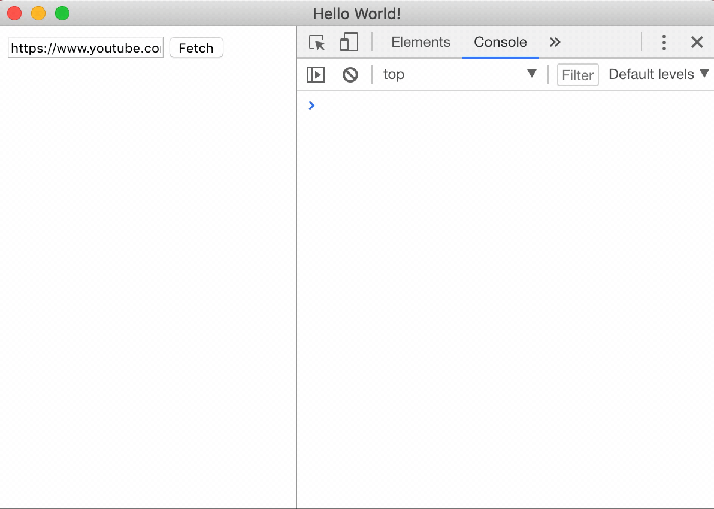

I had an idea in my head for some time - to build an app with [Electron](https://electronjs.org/). It’s part of my try to build with JavaScript apps in any platform that somehow it can be done: Browser (daa), mobile (React Native), server (NodeJS) and desktop (Electron).

What I have done with this idea? Nothing! Should be more motivation to make me do something than just for learning a new technology.

One night, my wife complained to me that she needs to download audio from youtube but she doesn’t want to download it one by one, but download a whole playlist. So I told her, “not a problem! why do you have a developer in your house if not for such cases”? And I did what every developer would do … search on Goggle. Probably the internet full of applications such this but I couldn’t find one that I liked. So, I remembered my idea and I knew that I’m gonna write it by myself.

First of all, I set some rules for me:

1. No Boilerplates! At all! All should be from scratch.

1. Open source friendly (**Not only open source, but also friendly**), all of it. 
[There will be no “How to contribute” guide. Contribute however you like!](https://github.com/moshfeu/y2mp3/blob/master/CONTRIBUTING.md)

1. CI-CD (travis-ci and appveyor) so `commit` will trigger build and tests and `release` will deploy the artifacts (windows, mac and ubuntu) to `releases`.

1. The app will be distribute to [Electron app market](https://electronjs.org/apps).

1. A server will not be involved in any way, all the process will be in the app so the usage in the app will not be trackable (except the network for youtube itself, of course). It’s an important: The app will not track any activity, no Google Analytics or something or any caching in the server.

1. The stack will include, eventually:
- React and MobX, not because it needed but because I wanted to practise (React) and learn (MobX).
- Test library — Jest.
- TypeScript, of course.
- Webpack — I used it before but I wanted to learn how to build it from scratch, not just use a boilerplate.

1. Free — no ads.

1. The architecture will be as simple as possible — small components so people could easily understand and learn.

1. Download not public videos is forbidden!

1. Keeps doing it for fun! No pressure.

## Step 1 — Project kickoff

 on [Unsplash](https://unsplash.com?utm_source=medium&utm_medium=referral)](04I2DD-PLAryoBqW7)*Photo by [cesar marquez](https://unsplash.com/@cesspho?utm_source=medium&utm_medium=referral) on [Unsplash](https://unsplash.com?utm_source=medium&utm_medium=referral)*

1. Open a Github repo with a name that I will regret very soon — ✓.

1. Read and implement the [quick start](https://electronjs.org/docs/tutorial/first-app) of Electron — ✓.

With nothing but Electron and JavaScript and with help with 2 packages:

* [https://github.com/CodeDotJS/youtube-playlist](https://github.com/CodeDotJS/youtube-playlist).
* [https://github.com/ytb2mp3/youtube-mp3-downloader](https://github.com/ytb2mp3/youtube-mp3-downloader).

*This is how it looks so far*

[Source code](https://github.com/moshfeu/y2mp3/tree/a8aaeb700f276aee4351676b9504f637a84d8c95)

In short, it retrieve the videos ids (youtube-playlist) and adding a request for download and convert them to mp3, to a queue (youtube-mp3-downloader).

In the next episodes of the series I will follow the 10 rules. Stay tuned!