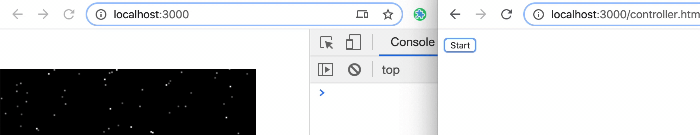
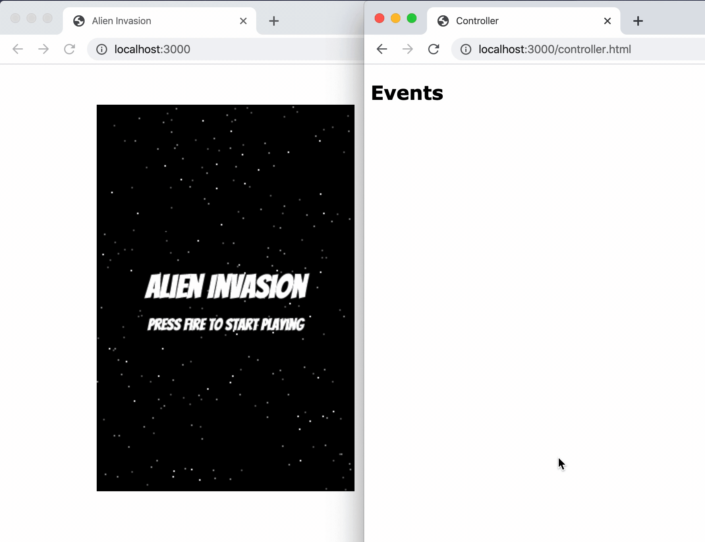

During the Covid 19 “vacation” I wanted to create a project for my 12 years old sun. He likes computer games and he likes Arduino.

I wanted to focus on the connectivity and the Arduino part but not on developing the game itself. So the plan is to take an existing html5 game which controlled by keyboard and add the ability to control it from an external “controller” which will be connected through a server to the game host using socket.

Like any project, I like to do small steps. Do one simple step, make sure it’s working and “complicate” it a bit more. There are the steps:

* First, control it from a different browser window using the same keyboard keys.

* Then, control it from a mobile phone on the same network of course.

* Finally, control it through an nodemcu esp8266 controller which has a builtin wifi module to make it easier to establish a connection.

I was looking for a very simple light weight html5 game. As less dependencies as possible. The chosen game… [https://github.com/cykod/AlienInvasion](https://github.com/cykod/AlienInvasion) (it’s an old one, I know)

## Installing dependencies

```bash
yarn add express socket.io @types/socket @types/express
```


I like types..

## Control the game from a different window

Currently, the user can control the game using the keyboard. The idea is to “send” the event from the controller to the game. While it’s not possible to send the **actual** event over socket, I’ll send only `code` and `keyCode` to the server. Those will be enough for dispatching the event in the game.

Let’s start from the server. To establish a socket, as the post’s title mention, I’m using NodeJS and socket.io. The server also will serve the “statics” — html and js files.

Since I’m new in socket.io, I’m following the “[Getting Started](https://socket.io/get-started/chat/)” guide.
First thing is to run an express server

```js
const express = require('express');
const app = express();
const http = require('http').createServer(app);
const io = require('socket.io')(http);

app.use(express.static(__dirname));

app.get('/', (req, res) => {
  res.sendFile(__dirname + '/index.html');
});

io.on('connection', (socket) => {
  console.log('a user connected');
});

http.listen(3000, () => {
  console.log('listening on *:3000');
});
```


This is the very basic code to establish a socket connection.

Now, the server should listen to events through socket from the controller and “transmit” to the game.

```js
io.on('connection', (socket) => {
  socket.on('event', message => {
    socket.broadcast.emit('event', message);
  });
});
```


Notice that I’m using `socket.broadcast.emit` . This way it will send the events “to all clients except sender”.

Next thing is connecting the clients. The first connection is very simple:

```js
const socket = io();
```


I’m adding 2 files to the project (except the server code and package.json and.. well you get my point)

* *controller.html* — to demonstrate.. well.. the controller (which will be the Arduino eventually).

* *remotely.js* — for taking care of the “remote” layer. Will be added to the game file.

Currently, I want to make sure that both of the clients are connected over socket.

*controller.html*

```html
<button>Start</button>
<script>
  const socket = io();
  document.querySelector('button').addEventListener('click', () => {
    socket.emit('key', 'start');
  });
</script>
```


*remotely.js*

```js
const socket = io();
socket.on('key', console.log);
```


*Click on “start” in the controller, create’s a log in the game*

Next step will be to actually “transmit” the “events” from the controller to the game

*controller.html*

```js
function isRelevantKey(key) {
  return ['ArrowRight', 'ArrowLeft', ' '].includes(key);
}

['keydown', 'keyup'].forEach(type => {
  window.addEventListener(type, ({key, keyCode}) => {
    if (isRelevantKey(key)) {
      socket.emit('event', {type, key, keyCode});
    }
  });
});
```


*remotely.js*

```js
socket.on('event', ({type, key, keyCode}) => {
  const evt = new KeyboardEvent(type, {
    key,
    keyCode
  });
  window.dispatchEvent(evt);
});
```


*Pressing on the keyboard while controller.html is in focus, moves the mothership in the game window*

In the next post I’ll start the second step — turn my mobile phone to a controller and then will come the interesting part. To make it more interesting, I’ll add try to add a “joystick” UI to it. I hope to find a ready one 🤞

Feel free to review the [source code](https://github.com/moshfeu/AlienInvasion) and the relevant [commit](https://github.com/moshfeu/AlienInvasion/commit/f6772b09d48f06b277398e0065644e26073eb208) on Github.

Have something to say? I’d love to 👂
[https://twitter.com/moshfeu](https://twitter.com/moshfeu)