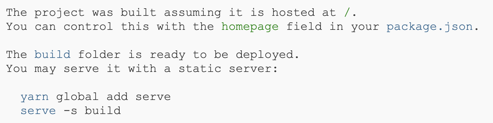

## What is `serve`?

`serve` is a package aims to easily run HTTP server for serving static files, such as HTML, CSS, JavaScript, and images. It is designed to be easy to use and requires no configuration.

https://www.npmjs.com/package/serve

As a React developer (just like [this](https://stackoverflow.com/q/49341084/863110) guy), you might heard about `serve` when you run `npm build`.
With `serve` you can run your app in production mode locally.



## But why if you need to run your app under HTTPS?

There are some reasons why you might want to run your web application under HTTPS. For instance, if an sdk you use requires to run under HTTPS, or if you want to test your app on mobile devices, you will need to run it under HTTPS.

I needed to run my app under HTTPS because my app is PWA which requires to run ServiceWorker. Service workers only work over HTTPS <sub>[1]</sub>.

You are probably here to know how to run serve under https so instead of bumbling around, here are the steps:

### Create a self-signed certificate

```bash
openssl req -x509 -newkey rsa:4096 -keyout key.pem -out cert.pem -sha256 -days 365
```

Answer all the questions (most of them are optional). Remember the passphrase you entered, you will need it for the next step.

### Create pass.phrase file

The content of this file should be the passphrase you entered when you created the certificate.

### Run `serve` with the certificate

```bash
serve -s path/to/folder --ssl-cert cert.pem --ssl-key key.pem --ssl-pass pass.phrase
```

Thanks to [Warren Bank](https://github.com/warren-bank) for his [comment](https://github.com/vercel/serve/issues/614#issuecomment-1041177815)

----------------------------------------

  [1] https://developer.mozilla.org/en-US/docs/Web/API/Service_Worker_API#:~:text=Service%20workers%20only%20run%20over%20HTTPS%2C%20for%20security%20reasons