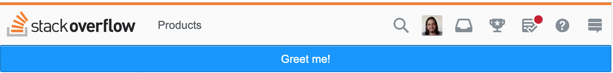
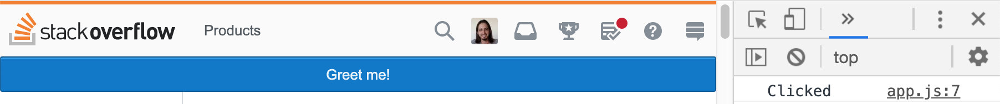

Notifications are great. When an app wants to take its user attention, usually when a (long) process was done and maybe the user moved to another tab or even to another app, a notification will let the user to know about the process and maybe could take them back to the app so they could continue with their interactions.

Google Chrome Extensions are also great. An extension helps a developer to extend the browser / a website functionality by running extra code in the context of specific website(s) or in general.

There are plenty of tutorials about how to write Chrome extensions and the [official website](https://developer.chrome.com/extensions/getstarted) is also a good resource and contains explanations and examples, so it will not be covered in that post. The post presume that you have already some basic knowledge of developing a Chrome extension but, still, refers to the relevant resources in the right places.

## What we gonna do?

Let’s take a very basic extension that appends a button in a webpage. Click on that button will cause the browser to display a notification like in the picture in the top of the post.

## Let’s do this

First, so we could leave it behind, let’s create the manifest file. Something like this:

```json
{
  "name": "Greeter Robot",
  "version": "1.0",
  "content_scripts": [
    {
      "matches": ["http://*/*", "https://*/*"],
      "js": [
        "js/app.js"
      ]
    }
  ],
  "browser_action": {
    "default_icon": "icon.png"
  },
  "manifest_version": 2
}
```


**Step 1** - we’ll use the [content script](https://developer.chrome.com/extensions/content_scripts) (app.js) to manipulate the site’s DOM and add a `&lt;button /&gt;`

```js
const button = document.createElement('button');
button.textContent = 'Greet me!'
document.body.insertAdjacentElement('afterbegin', button);
```


Now, if you’ll browse, let’s say StackOverflow, you will see the button very nicely

*The button that the extension added*

**Step 2** - we’ll add it a `click` handler, just to make sure it works

```js
const button = document.createElement('button');
button.textContent = 'Greet me!'
document.body.insertAdjacentElement('afterbegin', button);
button.addEventListener('click', () => {
  console.log('Clicked');
});
```


And it does

*Click on the button, log “clicked”*

## Let’s show a Notification

The obvious step is to go to the Notification [official docs](https://developer.chrome.com/extensions/notifications). There we can find the [API](https://developer.chrome.com/extensions/notifications#methods)

```js
chrome.notifications.create(string notificationId, NotificationOptions options, function callback)
```


So in our case, we will call that code:

```js
chrome.notifications.create('', {
  title: 'Just wanted to notify you',
  message: 'How great it is!',
  iconUrl: '/robot-face_1f916.png',
  type: 'basic'
});
```


Sadly, we get the error
> Uncaught TypeError: Cannot read property ‘create’ of undefined

## Why?

This API method (Among others) not meant to be called from a content script (remember?) but only from background script
> Content scripts can access Chrome APIs used by their parent extension by exchanging [**messages](https://developer.chrome.com/extensions/messaging)** with the extension

This gives us also the solution — using a [background script](https://developer.chrome.com/extensions/background_pages).

So instead of calling directly to the Notification API from the client script, we should send a message to the background script with the options and create the notification from there.

## How it will look?

First, we need to (create and) [register](https://developer.chrome.com/extensions/background_pages#manifest) another script — the background script, in the manifest file

```json
"background" : {
  "scripts" : ["js/background.js"],
  "persistent": false
}
```


And now, we could send to that script a message that we want to display a notification.

**app.js (content script)**

```js
button.addEventListener('click', () => {
  chrome.runtime.sendMessage('', {
    type: 'notification',
    options: {
      title: 'Just wanted to notify you',
      message: 'How great it is!',
      iconUrl: '/icon.png',
      type: 'basic'
    }
  });
});
```


**background.js (background script)**

```js
chrome.runtime.onMessage.addListener(data => {
  if (data.type === 'notification') {
    chrome.notifications.create('', data.options);
  }
});
```


Now, the extension will present a notification just like in the picture in the top of the post.

## Source Code

[https://github.com/moshfeu/chrome-extension-notification-demo](https://github.com/moshfeu/chrome-extension-notification-demo)

Have something to say? I’ll love to 👂